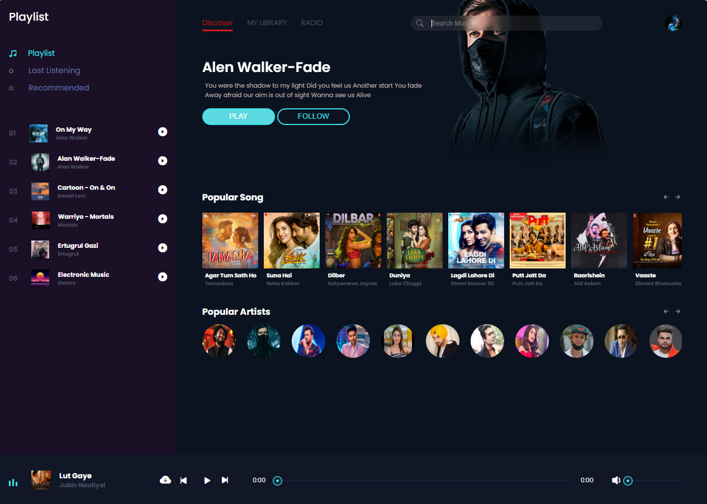

---

# Music World 🎵

Music World is an online MP3 music streaming site built with **HTML**, **CSS**, and **JavaScript**. Listen to your favorite songs, albums, and playlists anytime, anywhere. Enjoy high-quality audio and a fast, responsive design.

## Features 🚀

- 🎶 **Stream Music**: Play your favorite songs online.
- 📁 **Organized Content**: Browse through albums, playlists, and genres.
- ⚡ **Responsive Design**: Enjoy a seamless experience across devices.
- 🎧 **High-Quality Audio**: Experience crystal-clear sound.
- 🌐 **Cross-Browser Compatibility**: Works on all modern web browsers.

## Tech Stack 🛠️

- **HTML**: For structuring the website.
- **CSS**: For styling and creating a responsive layout.
- **JavaScript**: For interactivity and dynamic content.

## How to Use 📖

1. Clone this repository:
   ```bash
   git clone https://github.com/SyedaFatimaZehra/Music-World-Website.git
   ```
2. Navigate to the project directory:
   ```bash
   cd Music-World-Website
   ```
3. Open the `index.html` file in your browser to start streaming music.

## Screenshot 📸

Here is a preview of the Music World interface:



## Contributing 🤝

Contributions are welcome! If you'd like to contribute to Music World, please follow these steps:

1. Fork the repository.
2. Create a new branch:
   ```bash
   git checkout -b feature-name
   ```
3. Make your changes and commit them:
   ```bash
   git commit -m "Add feature-name"
   ```
4. Push to the branch:
   ```bash
   git push origin feature-name
   ```
5. Submit a pull request.

## License 📜

This project is licensed under the [MIT License](./LICENSE).

## Contact 📬

If you have any questions or suggestions, feel free to reach out at your GitHub profile: [SyedaFatimaZehra](https://github.com/SyedaFatimaZehra)

---

